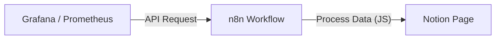

# 🏗️ Panduan Implementasi Laporan Otomatis Server (Grafana + n8n + Notion)

  

Dokumen ini menjelaskan langkah-langkah implementasi lengkap untuk mengotomatisasikan pembuatan laporan performa server bulanan menggunakan Grafana HTTP API, n8n, dan Notion.

  

---

  

## 🚀 Alur Kerja Sistem

  



  

1. **Schedule Trigger**: n8n berjalan otomatis secara terjadwal.

2. **HTTP Request**: Menarik metrik CPU, RAM, Disk, dan Uptime dari Grafana HTTP API.

3. **Code Node (JavaScript)**: Mengolah data JSON mentah, menghitung rata-rata & nilai puncak, mendeteksi anomali, dan menyusun laporan bulanan berformat Markdown.

4. **Notion Node**: Membuat halaman laporan baru di database Notion.

  

---

  

## 🛠️ Langkah Demi Langkah Implementasi

  

### Langkah 1: Persiapan Akses Grafana API

Untuk menghubungkan n8n ke Grafana, buatlah Service Account di Grafana Dashboard:

1. Navigasi ke **Administration** > **Users and Access** > **Service Accounts**.

2. Buat Service Account baru bernama `Server-Report` dengan role **Viewer**.

3. Klik **Add service account token**, beri nama token, lalu salin token rahasia yang muncul (berbentuk string yang diawali dengan `glsa_...`).

4. **Verifikasi Token**: Jalankan perintah ini di terminal Anda untuk mendapatkan **Prometheus Datasource UID**:

   ```bash

   curl -H "Authorization: Bearer <TOKEN_GLSA_ANDA>" http://<IP_ATAU_DOMAIN_GRAFANA>:3000/api/datasources

   ```

   Catat nilai `"uid"` dari datasource yang memiliki `"type": "prometheus"` (contoh: `ffrn8wd667h1cf`).

  

---

  

### Langkah 2: Membuat Integrasi & Database Notion

1. Pergi ke **[notion.so/my-integrations](https://www.notion.so/my-integrations)**.

2. Klik **+ New integration**. Pilih workspace Anda, beri nama (misal: `ilham-server-report-notion`), pilih opsi **Access token**, lalu klik **Create connection**.

3. Salin **Internal Integration Token** yang diawali dengan `secret_...`.

4. Buka database Notion Anda (misal: bernama `New database`).

5. Klik ikon tiga titik **`...`** di pojok kanan atas halaman database > pilih **Connect to** > cari dan pilih **`ilham-server-report-notion`** > klik **Confirm**.

  

---

  

### Langkah 3: Membuat Alur Kerja di n8n

  

Buatlah alur kerja baru di n8n dengan susunan node berikut:

  

#### 1. Node 1: Schedule Trigger (Pemicu Jadwal)

* **Trigger Interval**: `Days` (atau `Months` untuk laporan bulanan).

* **Trigger at Hour**: `20` (Jam 8 malam).

* **Trigger at Minute**: `50` (Menit ke-50).

  

#### 2. Node 2: HTTP Request (Menarik Metrik Grafana)

* Klik tombol **Import cURL** di pojok kanan atas pengaturan node, lalu tempel (*paste*) perintah di bawah ini (sesuaikan URL Grafana, Token `glsa_...`, dan `uid` datasource Anda):

  ```bash

  curl -X POST \

    -H "Authorization: Bearer glsa_xxxxx" \

    -H "Content-Type: application/json" \

    -d '{"queries": [{"refId": "CPU", "datasource": {"type": "prometheus", "uid": "ffrn8wd667h1cf"}, "expr": "100 - (avg by (instance) (irate(node_cpu_seconds_total{mode=\"idle\"}[5m])) * 100)"}, {"refId": "RAM", "datasource": {"type": "prometheus", "uid": "ffrn8wd667h1cf"}, "expr": "((node_memory_MemTotal_bytes - node_memory_MemAvailable_bytes) / node_memory_MemTotal_bytes) * 100"}, {"refId": "Disk", "datasource": {"type": "prometheus", "uid": "ffrn8wd667h1cf"}, "expr": "((node_filesystem_size_bytes{mountpoint=\"/\"} - node_filesystem_free_bytes{mountpoint=\"/\"}) / node_filesystem_size_bytes{mountpoint=\"/\"}) * 100"}, {"refId": "Uptime", "datasource": {"type": "prometheus", "uid": "ffrn8wd667h1cf"}, "expr": "node_time_seconds - node_boot_time_seconds"}], "from": "now-30d", "to": "now"}' \

    http://20.48.225.29:3000/api/ds/query

  ```

* Klik **Import** lalu klik **Execute step** untuk memastikan data berhasil ditarik.

  

#### 3. Node 3: Code Node (Mengolah Data Menjadi Markdown)

* Tambahkan node **Code** di sebelah kanan HTTP Request.

* Atur **Mode**: `Run Once for All Items`.

* Masukkan kode JavaScript berikut:

  ```javascript

  const input = $input.first().json;

  const results = input.results;

  

  function analyzeMetric(metricName) {

    try {

      const frames = results[metricName]?.frames;

      if (!frames || frames.length === 0) return { avg: 0, peak: 0, status: 'Unknown' };

      const values = frames[0].data?.values;

      if (!values || values.length < 2) return { avg: 0, peak: 0, status: 'Unknown' };

      const metricValues = values[1].filter(v => v !== null && v !== undefined);

      if (metricValues.length === 0) return { avg: 0, peak: 0, status: 'Unknown' };

      const sum = metricValues.reduce((a, b) => a + b, 0);

      const avg = sum / metricValues.length;

      const peak = Math.max(...metricValues);

      let status = 'Optimal';

      if (peak >= 90) status = 'Critical';

      else if (peak >= 75) status = 'Warning';

      return {

        avg: avg.toFixed(2),

        peak: peak.toFixed(2),

        status: status

      };

    } catch (e) {

      return { avg: 0, peak: 0, status: 'Error' };

    }

  }

  

  function getUptimeDays() {

    try {

      const frames = results['Uptime']?.frames;

      if (!frames || frames.length === 0) return 0;

      const values = frames[0].data?.values;

      if (!values || values.length < 2) return 0;

      const metricValues = values[1].filter(v => v !== null && v !== undefined);

      if (metricValues.length === 0) return 0;

      const latestSeconds = metricValues[metricValues.length - 1];

      return (latestSeconds / 86400).toFixed(2);

    } catch (e) {

      return 0;

    }

  }

  

  const cpu = analyzeMetric('CPU');

  const ram = analyzeMetric('RAM');

  const disk = analyzeMetric('Disk');

  const uptimeDays = getUptimeDays();

  

  const date = new Date();

  const months = ["Januari", "Februari", "Maret", "April", "Mei", "Juni", "Juli", "Agustus", "September", "Oktober", "November", "Desember"];

  const currentPeriod = `${months[date.getMonth()]} ${date.getFullYear()}`;

  

  let report = `# 📊 Laporan Performa Server - Server-Report-1

  **Periode:** ${currentPeriod}  

  **Uptime Rate:** ${uptimeDays} Hari Aktif

  

  ## 📈 1. Ringkasan Utilitas Resource

  | Resource | Rata-rata (Average) | Puncak (Peak) | Status |

  | :--- | :--- | :--- | :--- |

  | **CPU** | ${cpu.avg}% | ${cpu.peak}% | ${cpu.status} |

  | **RAM** | ${ram.avg}% | ${ram.peak}% | ${ram.status} |

  | **Disk** | ${disk.avg}% | ${disk.peak}% | ${disk.status} |

  

  ## ⚠️ 2. Ringkasan Insiden & Anomali

  *Analisis otomatis metrik menunjukkan:*

  `;

  

  let anomalies = [];

  if (parseFloat(cpu.peak) > 80) {

    anomalies.push(`* Terdeteksi lonjakan penggunaan CPU hingga **${cpu.peak}%** (Melebihi ambang batas 80%).`);

  }

  if (parseFloat(ram.peak) > 85) {

    anomalies.push(`* Terdeteksi penggunaan memori puncak mencapai **${ram.peak}%**.`);

  }

  if (parseFloat(disk.peak) > 90) {

    anomalies.push(`* Ruang penyimpanan kritis: penggunaan Disk mencapai **${disk.peak}%**.`);

  }

  

  if (anomalies.length === 0) {

    report += `* Tidak terdeteksi anomali atau insiden signifikan pada resource utama selama periode ini. Kinerja server stabil.\n`;

  } else {

    report += anomalies.join('\n') + '\n';

  }

  

  report += `\n## 💡 3. Rekomendasi AI & Optimasi\n`;

  

  let recommendations = [];

  if (parseFloat(cpu.peak) > 80) {

    recommendations.push("1. **Rekomendasi Kapasitas**: Pertimbangkan untuk melakukan scaling vCPU atau mengoptimalkan proses latar belakang jika beban CPU sering berada di atas 80%.");

  } else {

    recommendations.push("1. **Rekomendasi Kapasitas**: Kapasitas CPU saat ini sangat mencukupi, tidak diperlukan perubahan spesifikasi.");

  }

  

  if (parseFloat(ram.peak) > 85) {

    recommendations.push("2. **Optimasi Memori**: Lakukan pengecekan terhadap memory leaks pada aplikasi utama atau tambahkan RAM virtual (swap space).");

  } else {

    recommendations.push("2. **Optimasi Memori**: Penggunaan RAM berada dalam batas aman dan efisien.");

  }

  

  if (parseFloat(disk.peak) > 80) {

    recommendations.push("3. **Pembersihan Disk**: Lakukan rotasi log, bersihkan file sampah/cache berkala untuk mencegah disk penuh.");

  } else {

    recommendations.push("3. **Pembersihan Disk**: Kapasitas penyimpanan masih aman.");

  }

  

  report += recommendations.join('\n') + '\n';

  

  return [{ json: { report: report, cpu: cpu, ram: ram, disk: disk, uptime_days: uptimeDays } }];

  ```

  

#### 4. Node 4: Notion Node (Kirim Laporan ke Database)

* Tambahkan node **Notion** di sebelah kanan Code.

* **Credential**: Klik *Set up credential* dan masukkan token rahasia `secret_...` Anda.

* **Resource**: `Database Page`

* **Operation**: `Create`

* **Database**: Pilih database Anda (`New database`).

* **Title**: Masukkan judul laporan (misal: `Laporan Server Test`).

* **Properties**: (Hapus properti kosong jika tidak digunakan agar tidak terjadi error).

* **Blocks** > **Add Block**:

  * Pilih type: **`Paragraph`**.

  * Kolom **Text**: Aktifkan mode **Expression** dan ketik:

    ```text

    {{ $json.report }}

    ```

* Klik **Execute step** untuk menguji pengiriman.

  

---

  

## 🔔 Mengaktifkan Workflow

Jika semua langkah di atas sudah teruji dengan sukses, silakan klik tombol **`Publish`** atau aktifkan saklar toggle status alur kerja ke **Active** di pojok kanan atas layar n8n Anda agar berjalan secara otomatis setiap hari.
